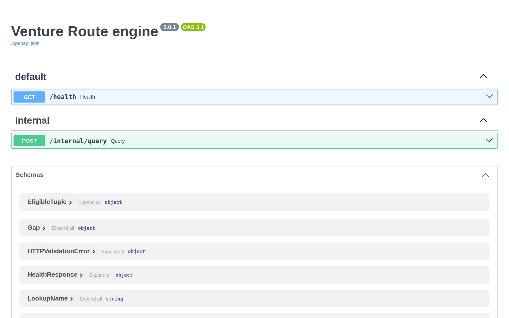
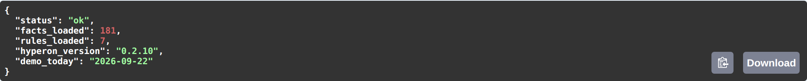
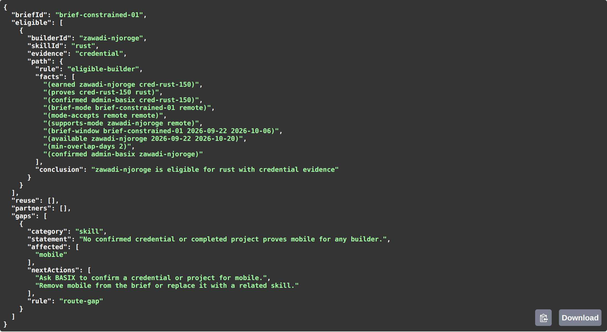

# Venture Route

> Evidence-backed venture routing through the BASIX ecosystem.

**Status:** Hackathon proof of concept — demo data only.

Venture Route helps a founder turn an MVP brief into the smallest credible route through a BASIX-shaped ecosystem: verified labour, reusable IP, cohort and university context, relevant partners, daily cost, and explicit capability gaps.

It is not an AI matcher. A language model may make the intake conversational and explain an already-computed result, but it never decides eligibility, ranks people, or invents evidence. MeTTa relationship rules and inspectable source facts are the authority for recommendations.

## The founder question

> Given my desired MVP, constraints, and budget, what is the smallest credible route through the BASIX ecosystem—and why should I trust it?

## Product principles

- **Evidence-backed routing:** A builder is verified for a requested skill only when a credential proves that skill, a completed project demonstrates it, or both.
- **MeTTa is authoritative:** The graph evaluates eligibility, availability, delivery-mode compatibility, reusable-IP fit, partner fit, and evidence paths.
- **LLM safety boundary:** LLMs extract a candidate founder brief and explain route results only. They cannot select, reject, rank, or substitute entities; invent evidence; or mutate graph data.
- **Honest gaps:** When a hard constraint cannot be met, the product returns an explicit capability gap and supported next actions—never a fabricated match.
- **Demo data only:** All initial builders, credentials, projects, cohorts, universities, and partners are synthetic and visibly labelled **Demo data**.
- **Local-first:** The hackathon MVP runs locally and has a structured-form fallback when LLM or network access is unavailable.

## Founder workflow

1. A founder describes an MVP or completes the structured brief form.
2. The application validates a normalized brief before routing.
3. MeTTa evaluates relationship facts and named rules.
4. Deterministic application logic selects the smallest feasible team within the team-size and total daily-budget limits.
5. The founder receives a route with evidence paths, named rules, cost, optional reusable IP, context, partner, and any capability gaps.

## Architecture

```text
React client
  → typed conversation API
    → conversation orchestrator
      → LLM intake / explanation adapter
      → brief schema validation
      → route service
        → MeTTa route adapter → local MeTTa runtime + facts + rules
        → deterministic bounded team assembler
      → safe response presenter
```

The browser does not invoke MeTTa directly, parse raw MeTTa output, or hold LLM credentials.

### MeTTa decision boundary

The server-side `MettaRouteEngine` (Python, inside the FastAPI service) is the only module that knows about the Hyperon runtime, query syntax, fact/rule loading, and output parsing. It provides typed results that include entity identifiers, evidence type, named rule, and ordered source facts.

Core rule outcomes:

- verified for skill;
- delivery-mode and location compatibility;
- availability overlap with the founder's requested dates;
- eligible builder;
- reusable-IP fit;
- partner fit;
- route gaps.

## Founder brief

A validated brief includes:

- title and stable ID;
- vertical (`health`, `agri`, or `education` initially);
- required skills;
- maximum team size;
- availability start and end dates;
- delivery mode (`remote`, `hybrid`, or `on-site`) and on-site location when applicable;
- total team daily budget in a single demo currency;
- reusable-IP preference.

Builders qualify for a requested date range when their seeded availability interval overlaps it. A founder can review and edit extracted values before routing; the latest explicit founder correction wins.

## Route result

Each route can include:

- selected builders, covered skills, total daily rate, and credential/project/both evidence labels;
- per-builder × skill evidence paths;
- optional reusable IP asset;
- cohort and university context;
- ecosystem partner;
- named MeTTa rules and source facts;
- partial-route or infeasible status with explicit capability gaps and approved next actions.

Routes are described as the smallest feasible route under the current rules. Team selection uses deterministic exhaustive search within the small configured team-size ceiling, not opaque scoring.

## Demo scenarios

- **Health pilot:** Python, AI/MeTTa, UI/UX; hybrid delivery; reusable health IP preferred.
- **Agri marketplace:** Frontend, backend, and domain/community research with materially different route context.
- **Constrained brief:** Mobile and Rust in a short window; returns an honest mobile capability gap.
- **Budget challenge:** Lower the Health budget below a feasible route's total daily rate.
- **Delivery-mode challenge:** Request an unsupported on-site location and receive a location/mode gap.

## Delivery gates

Before frontend work, the project will demonstrate a real local MeTTa runtime that:

1. starts locally;
2. loads deterministic fixture facts;
3. executes a named rule;
4. returns a parseable multi-hop result; and
5. is invoked in-process from the Python adapter in a pytest contract test that fails if the runtime is unavailable, a rule does not execute, or output cannot be parsed.

The adapter returns typed Pydantic results and rejects malformed or unexpected runtime output. The MVP must never silently replace MeTTa reasoning with an in-memory Python or TypeScript matcher.

## Planned stack

- React 18 + Vite + TypeScript client, Tailwind and shadcn/ui, installable PWA (desktop-first)
- Python 3.12 + FastAPI + Pydantic v2 engine and API service, with the official `hyperon` runtime loaded in-process
- Zod schemas (client and API edge) mirrored by Pydantic models (server) for brief and route contracts
- Clerk for auth and roles; Neon Postgres (SQLModel + Alembic inside the FastAPI service) for marketplace persistence, projected into the MeTTa graph on admin confirmation
- Anthropic Claude behind a provider-agnostic adapter, server-side key, structured output, with a form-only fallback
- Vitest, React Testing Library and Playwright for the client; pytest for the engine, including a real-runtime adapter contract test
- Docker Compose (`engine`, `db`, `web`) for local runs; Vercel for the web client, Railway (Render fallback) for the engine container, Neon for the database
- Monorepo: `apps/web`, `services/engine`, `packages/contracts`

Planning follows the 120x Architect/Builder Operating Pack: start with `AGENTS.md`, then `planning/STATE.md` and `planning/TIMELINE.md` (demo: 1 October 2026). Stitch prompts for the UI live in `docs/design/stitch-prompts.md`.

## Getting started

The routing engine is the first thing that runs. Sprint 000 ships `services/engine`: a FastAPI service that loads the Hyperon (MeTTa) runtime in-process, reads the seed facts and the seven named rules, and exposes them over HTTP. The React client (`apps/web`) and Neon Postgres (`db`) come in later sprints. Until then, the engine's OpenAPI page is the user interface.



### Prerequisites

| Tool | Version | Needed for |
| --- | --- | --- |
| [Docker](https://docs.docker.com/get-docker/) with Compose v2 | recent | The one-command path (recommended) |
| [Python](https://www.python.org/downloads/) | **3.12.x** exactly (`>=3.12,<3.13`, pinned in `.python-version`) | Running the engine without Docker |
| [uv](https://docs.astral.sh/uv/getting-started/installation/) | 0.8+ | Python dependencies and the lockfile (`services/engine/uv.lock`) |
| [Node.js](https://nodejs.org/) + [pnpm](https://pnpm.io/) 9 | Node 20+ | Only for the Turborepo workspace and regenerating screenshots |

The engine pins `hyperon==0.2.10` and declares `requires-python = ">=3.12,<3.13"`. Python 3.11 and 3.13 won't resolve, so let `uv` provide 3.12 if your system Python is a different version (`uv python install 3.12`).

### 1. Clone and configure

```bash
git clone https://github.com/simpleHacker0893/basix-venture-route.git
cd basix-venture-route
cp .env.example .env
```

The engine reads every setting from the environment or from `.env`. The defaults in `.env.example` give a deterministic demo:

| Variable | Default | Purpose |
| --- | --- | --- |
| `DEMO_TODAY` | `2026-09-22` | Frozen demo clock that anchors the seed availability windows (D-14). |
| `MIN_OVERLAP_DAYS` | `2` | Minimum overlap in days between a builder's availability and the brief window (D-08). |
| `ENGINE_DEV_QUERY` | `0` | Set to `1` to expose `POST /internal/query`. **Never enable it on a deployed engine.** |
| `ENGINE_PORT` | `8000` | Host port Docker Compose publishes for the engine. |

No API keys are needed yet. The engine runs fully offline.

### 2a. Run with Docker (recommended)

```bash
docker compose up --build engine
```

The image is based on `python:3.12-slim`. It installs the locked dependencies with `uv`, runs as a non-root user and has a health check on `GET /health`. `docker compose ps` shows the service as `healthy` once the MeTTa space has loaded.

### 2b. Run locally with uv

```bash
cd services/engine
uv sync                                  # creates .venv with Python 3.12 and the locked deps
ENGINE_DEV_QUERY=1 uv run uvicorn app.main:app --reload --port 8000
```

`uv sync` installs the dev group too (pytest, httpx, ruff, mypy). Use `uv sync --no-dev` for a runtime-only environment.

### 3. Verify the install

The health endpoint confirms that Hyperon started, the seed graph loaded, and every named rule is present in the space. The space itself reports the rule count; it isn't a hard-coded constant.

```bash
curl -s http://localhost:8000/health
```

```json
{"status":"ok","facts_loaded":181,"rules_loaded":7,"hyperon_version":"0.2.10","demo_today":"2026-09-22"}
```



Open <http://localhost:8000/docs> for the interactive API, or read [`docs/API.md`](docs/API.md) for the contract.

### 4. Watch the rules reason (dev only)

With `ENGINE_DEV_QUERY=1`, you can run any seed brief (`brief-health-01`, `brief-agri-01`, `brief-constrained-01`, `brief-budget-01`, `brief-onsite-01`) through the engine:

```bash
curl -s -X POST http://localhost:8000/internal/query \
  -H 'content-type: application/json' \
  -d '{"briefId": "brief-constrained-01"}'
```

The constrained brief asks for Mobile and Rust in a short window. MeTTa proves one Rust builder eligible and shows the full fact path for that proof. It returns an explicit `route-gap` for Mobile rather than a made-up match:



With the flag off, the route answers `404`. Engine failures, such as the runtime being unavailable or rule output that can't be parsed, answer `502` with `engine error: ...`. The engine never falls back to a non-MeTTa matcher.

### Quality gates

Run these from `services/engine` before opening a pull request. Sprint acceptance (`planning/sprints/*/acceptance.md`) uses the same commands.

```bash
uv run ruff check .          # lint (E, F, I, B, UP, SIM)
uv run mypy app              # strict type-check, pydantic plugin
uv run pytest                # full suite
uv run pytest -m runtime     # real-Hyperon contract tests; they fail, never skip, if hyperon is missing
```

### Troubleshooting

| Symptom | Likely cause and fix |
| --- | --- |
| `No solution found when resolving dependencies` / `hyperon` wheel not found | Wrong Python. Run `uv python install 3.12`, then run `uv sync` again. |
| `rules_loaded` below `7` | `seed/rules.metta` has been edited and a named rule no longer parses. Run `uv run pytest -m runtime` to find which one. |
| `POST /internal/query` returns `404` for a valid ID | `ENGINE_DEV_QUERY` is not `1` in the engine's environment. |
| Port `8000` already in use | Set `ENGINE_PORT` in `.env` (Docker), or pass a different `--port` to uvicorn. |
| `/docs` renders a blank page | Swagger UI loads from `cdn.jsdelivr.net`. Allow that host, or use `curl` and `docs/API.md` instead. |

### Repository layout

```text
.
├── services/engine/        FastAPI + Hyperon routing engine (Python 3.12, uv)
│   ├── app/api/            HTTP routers: /health, /internal/query
│   ├── app/engine/         MettaRouteEngine: the only module that talks to the MeTTa runtime
│   ├── app/models/         Pydantic contracts (briefs, engine tuples)
│   ├── seed/               facts.metta, rules.metta, briefs.json (synthetic demo data)
│   └── tests/              pytest suite, including real-runtime contract tests
├── packages/contracts/     Shared Zod/Pydantic contracts (Sprint 001+)
├── docs/                   API contract, PRD, ADRs, design prompts, README images
├── planning/               Operating Pack: state, decisions, domain, sprint folders
├── scripts/                Repository tooling (README screenshot capture)
└── docker-compose.yml      Local stack; `engine` today, `db` and `web` later
```

For the operating rules and sprint process, start with [`AGENTS.md`](AGENTS.md), then [`planning/STATE.md`](planning/STATE.md). Architectural decisions are in [`docs/adr/`](docs/adr/).

### Regenerating the screenshots

The images above are captured from a running engine with Playwright, so they always show real responses:

```bash
# terminal 1
cd services/engine && ENGINE_DEV_QUERY=1 uv run uvicorn app.main:app --port 8000

# terminal 2, from the repository root
npm install --no-save playwright && npx playwright install chromium
node scripts/capture-readme-screenshots.mjs
```

Set `ENGINE_URL` to target another host, and set `SWAGGER_UI_DIST` to an unpacked `swagger-ui-dist` package if the CDN is unreachable.

## References

- [MeTTa language](https://metta-lang.dev/)
- [Hyperon experimental runtime](https://github.com/trueagi-io/hyperon-experimental)
- [MeTTa specification](https://trueagi-io.github.io/hyperon-experimental/metta/)

## License

MIT

---

Built as a BASIX-focused hackathon proof of concept. No real people, availability, credentials, IP ownership, or partner relationships are represented.
