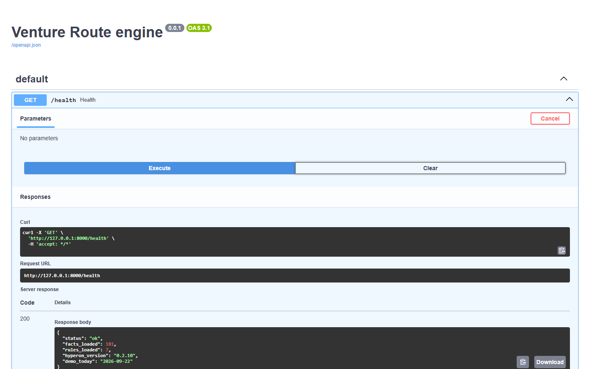
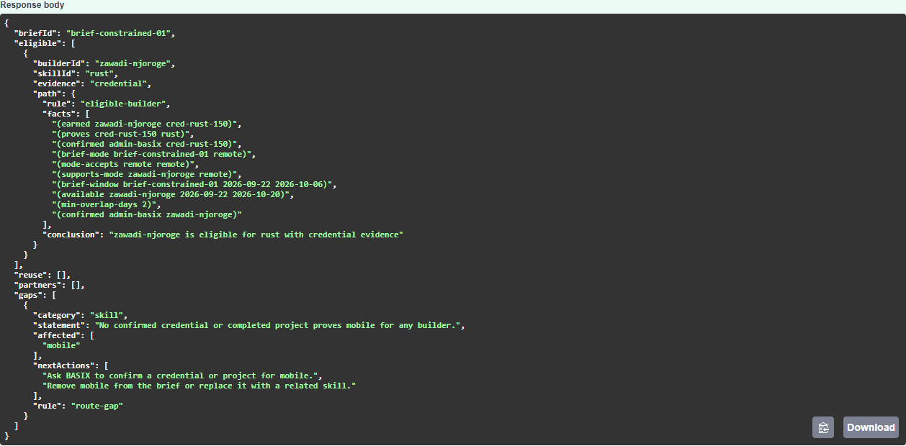

# Venture Route

> Evidence-backed venture routing through the BASIX ecosystem, decided by MeTTa graph rules.

**Status:** Sprint 000 shipped (MeTTa spike). Hackathon proof of concept for the SingularityNET MeTTa track, demo Thursday 1 October 2026. Demo data only.

Venture Route turns a founder's plain-language venture brief into the smallest credible route through a BASIX-shaped ecosystem: verified builders, reusable IP, cohort and university context, a relevant partner, daily cost, and explicit capability gaps.

It is not an AI matcher. MeTTa relationship rules over inspectable facts decide eligibility, evidence, availability, delivery-mode fit, reusable-IP fit, partner fit and gaps. A language model may make intake conversational and explain a computed route, but it never selects people, invents evidence, or sets the route status.

## What is running today

The engine service is live: FastAPI with the official Hyperon runtime (`hyperon==0.2.10`) loaded in-process, seven named MeTTa rules over a 181-atom fictional seed graph, and typed reasoning paths on every result.

`GET /health` proves the runtime loaded the graph and all seven rules:



`POST /internal/query` (dev-only) runs the rules for a seed brief. Below, the constrained brief asks for `mobile` and `rust`: the Rust builder is eligible with a full fact chain, and `route-gap` reports an honest `skill` gap for `mobile` with engine-supplied next actions instead of a fabricated match:



Both screenshots were captured with Playwright (`scripts/screenshots.sh`).

## Quick start

Five minutes to a running engine and a green test suite.

### Prerequisites

| Tool | Version | Notes |
|---|---|---|
| Python | 3.12.x | Pinned in `.python-version`. No hyperon wheel exists for 3.13. |
| uv | 0.8+ | Manages the engine's virtualenv and lockfile. |
| Git | any | |
| Docker + Compose v2 | optional | For the container path. |
| Visual C++ 2015-2022 runtime | Windows only | The hyperon Windows wheel needs `MSVCP140.dll`. `winget install Microsoft.VCRedist.2015+.x64` |

### Run natively

```bash
git clone https://github.com/simpleHacker0893/basix-venture-route.git
cd basix-venture-route/services/engine
uv sync                              # installs FastAPI, hyperon 0.2.10 and dev tools from uv.lock
uv run uvicorn app.main:app --reload # http://127.0.0.1:8000
```

Verify:

```bash
curl -s http://127.0.0.1:8000/health
# {"status":"ok","facts_loaded":181,"rules_loaded":7,"hyperon_version":"0.2.10","demo_today":"2026-09-22"}
```

Open http://127.0.0.1:8000/docs for the interactive API.

To query the rules for a seed brief, start the engine with the dev flag and post a brief ID:

```bash
ENGINE_DEV_QUERY=1 uv run uvicorn app.main:app
curl -s -X POST http://127.0.0.1:8000/internal/query \
  -H "content-type: application/json" \
  -d '{"briefId": "brief-health-01"}'
```

### Run with Docker

```bash
cp .env.example .env
docker compose up engine
curl -s http://localhost:8000/health
```

The image is `python:3.12-slim` with uv, a non-root user and a health check. The team verifies the container path on GitHub Codespaces; local Windows machines run the native path.

### Test, lint, type-check

```bash
cd services/engine
uv run pytest -q            # 35 tests, every one against the real Hyperon runtime
uv run ruff check .
uv run mypy app             # strict
```

There are no mocks of the runtime. The suite fails, never skips, when hyperon is missing (`tests/test_engine_errors.py` proves it by shadowing the package in a subprocess).

## Configuration

Copy `.env.example` to `.env`. Every variable the engine reads is listed there.

| Variable | Default | Purpose |
|---|---|---|
| `DEMO_TODAY` | `2026-09-22` | Frozen demo clock so seed availability windows stay deterministic (D-14). |
| `MIN_OVERLAP_DAYS` | `2` | Minimum inclusive overlap between a builder's availability and the brief window (D-08). |
| `ENGINE_DEV_QUERY` | `0` | `1` exposes `POST /internal/query`. Never enable in a deployed engine. |
| `ENGINE_PORT` | `8000` | Host port published by Docker Compose. |
| `LLM_PROVIDER` | `anthropic` | `anthropic` uses the official SDK with `claude-opus-5`; `null` serves every response without a model (D-06). |
| `ANTHROPIC_API_KEY` | unset | Server-side key read from `.env` only (D-26). Unset means the `null` adapter, never an error. |

The engine reads the repo-root `.env` first, then an optional `services/engine/.env` that overrides it, then the process environment. Secrets never live in the repo. Variables for later sprints (Neon `DATABASE_URL`, Clerk keys, `VITE_*`) are already listed in `.env.example` with placeholders and the sprint that reads them.

## Architecture

```text
React client (Sprint 002)
  → typed conversation API (Sprint 001)
    → conversation orchestrator
      → LLM intake / explanation adapter        receives only the structured VentureRoute
      → brief schema validation                 Zod on the edge, Pydantic on the server
      → route service
        → MettaRouteEngine ──► Hyperon runtime + seed/facts.metta + seed/rules.metta   ← shipped
        → deterministic team assembler          smallest covering team, status as a pure function
      → safe response presenter
```

### The decision boundary

`services/engine/app/engine/metta_engine.py` is the only module that knows about the Hyperon runtime, MeTTa syntax and atom parsing. Its five public methods are the seams every later layer builds on:

| Method | Named rule | Returns |
|---|---|---|
| `eligible_builders(brief)` | `eligible-builder` (over `verified-for-skill`, `mode-compatible`, `available-for-brief`) | one tuple per builder × skill with `credential`, `project` or `both` evidence |
| `reuse_candidates(brief)` | `reuse-fit` | licensable assets in the brief's vertical that demonstrate a required skill |
| `partner_candidates(brief, builder_ids)` | `partner-fit` | the four-hop chain vertical → partner → university → cohort → builder |
| `cohort_of(builder_id)` | `cohort-of` lookup | cohort and university |
| `gaps(brief)` | `route-gap` | `skill`, `availability`, `mode` or `location` gap per required skill |

Every result carries a **reasoning path**: the rule name, the ordered source facts exactly as written in the space, and a one-line conclusion. The UI renders these; the language model only narrates them.

How a query runs: the brief's fields are added to the space as `brief-*` atoms under a lock, one `!(rule ...)` expression is evaluated, the witnesses (which embed the facts they matched) are parsed into Pydantic models, and the brief atoms are removed. Date overlap is the one Python-grounded atom (`overlap-days`); the rule that combines it with everything else is MeTTa. There is no Python matcher, and the acceptance review greps to make sure one never appears.

### Named rules

`verified-for-skill`, `mode-compatible`, `available-for-brief`, `eligible-builder`, `reuse-fit`, `partner-fit`, `route-gap`. Definitions and semantics: `planning/DOMAIN.md`. Source: `services/engine/seed/rules.metta`. `/health` reports `rules_loaded` by asking the space for an equation of each one.

### Repository layout

```text
services/engine/        FastAPI + Hyperon engine (uv, Python 3.12)
  app/api/              /health, /internal/query
  app/engine/           MettaRouteEngine, grounded atoms, atom parsing, EngineError
  app/models/           VentureBrief (PRD §5.3), typed engine results
  seed/                 facts.metta, rules.metta, briefs.json (five demo scenarios)
  tests/                real-runtime contract, semantics, HTTP and error tests
packages/contracts/     Zod schemas (Sprint 001)
apps/web/               React client (Sprint 002)
docs/                   API.md, PRD.md, ADRs, Stitch prompts, screenshots
design/stitch/          Stitch HTML/Tailwind exports + screenshots per batch (see its README)
planning/               Operating pack: STATE, DECISIONS, DOMAIN, TIMELINE, sprints
docker-compose.yml      engine service (db and web arrive with later sprints)
```

## Demo scenarios

Seed briefs in `services/engine/seed/briefs.json`. Expected outcomes are pinned by tests.

| Brief ID | Scenario | Engine result today |
|---|---|---|
| `brief-health-01` | Health pilot: python, ai-metta, ui-ux; hybrid; USD 400/day; reusable IP | three eligible builders, `asset-afya-triage`, partner `amani-health` via four hops, no gaps |
| `brief-agri-01` | Agri marketplace: frontend, backend, domain-research; remote | a different team, `asset-shamba-records`, no gaps |
| `brief-constrained-01` | Mobile + Rust, remote, two weeks | Rust builder eligible, `skill` gap for mobile |
| `brief-budget-01` | Health pilot at USD 250/day | same eligibility; the `budget` gap is the Sprint 001 assembler's call |
| `brief-onsite-01` | Health pilot on-site in Kisumu | `location` gaps for all three skills |

All builders, credentials, projects, cohorts, universities and partners are fictional and carry `demoData: true`.

## Development workflow

Planning follows the 120x Architect/Builder Operating Pack. Start with `AGENTS.md`, then `planning/STATE.md`, `planning/DECISIONS.md`, `planning/DOMAIN.md`, `planning/TIMELINE.md` and the current sprint folder.

- One branch and one pull request per sprint (`sprint/NNN-slug`), gated by the sprint's `acceptance.md` with pasted command output.
- Tickets are GitHub Issues labelled `sprint:NNN` and `ready-for-agent`, sliced with the Matt Pocock skills (`/to-tickets`, `/implement`, `/tdd`, `/code-review`).
- Tests are written only at the seams fixed per sprint in `planning/PROMPTS.md`.
- Conventional Commits. Python: ruff and mypy strict. TypeScript: strict and eslint.
- Glossary in `CONTEXT.md`; decisions as ADRs in `docs/adr/`.

### Roadmap

| Sprint | Window (EAT) | Delivers |
|---|---|---|
| 000 MeTTa spike | done | engine, rules, seed graph, `/health`, contract tests |
| 001 Routing core | 23–24 Sep | `POST /api/conversation`, team assembler, deterministic status, Zod ↔ Pydantic contracts, LLM adapter with form fallback |
| 002 Founder UI | 25–26 Sep | React intake, brief review, route result with gaps first, "Why this route?" drawer, PWA |
| 003 Marketplace | 27–28 Sep | Clerk roles, Neon Postgres, admin confirmation projected into the graph |
| 004 Requests & interviews | 29 Sep | requests board, eligibility-gated bids, bookings |
| 005 Demo hardening | 30 Sep | single launch command, Railway + Vercel deploy, recording |

## Contributing

1. Read `AGENTS.md`; the non-negotiables there are enforced in review.
2. Pick an open issue labelled `ready-for-agent` for the current sprint.
3. Write the failing test at an agreed seam first, then the minimal code, then run `uv run pytest -q`, `uv run ruff check .` and `uv run mypy app`.
4. Commit per ticket with a Conventional Commit message ending in `(#issue)`.
5. Open questions go to `planning/QUESTIONS.md`; never guess a business rule.

## References

- [MeTTa language](https://metta-lang.dev/)
- [Hyperon experimental runtime](https://github.com/trueagi-io/hyperon-experimental)
- [MeTTa specification](https://trueagi-io.github.io/hyperon-experimental/metta/)
- Engine API: `docs/API.md`. Product requirements: `docs/PRD.md`.

## License

MIT

---

Built as a BASIX-focused hackathon proof of concept. No real people, availability, credentials, IP ownership, or partner relationships are represented.
